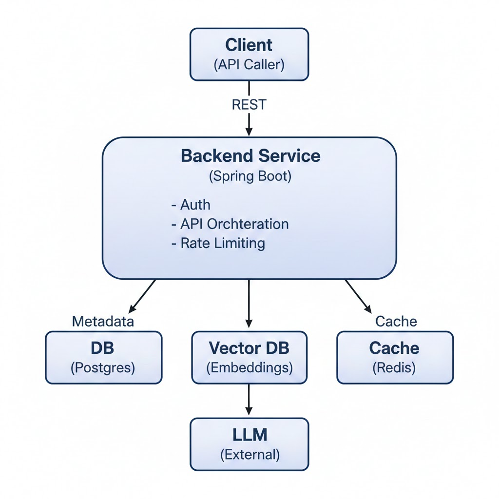

### **1. Problem Statement**

**What problem are we solving?**

Today, users have large documents (PDFs, notes, logs, design docs) and want quick, accurate answers without manually
searching or reading everything. Existing tools are either generic chatbots or lack backend control, observability, and
security.

This system allows users to:

    * Upload documents
    * Ask natural language questions
    * Get grounded answers only from their documents

### **2. Users**

**Who uses this system?**

Primary users:

    * Software engineers (design docs, RFCs)
    * Students (notes, PDFs)
    * Internal teams (knowledge base Q&A)

Secondary users:

    Admins (monitor usage, cost, performance)

### **3. Non-Goals (Very Important for Interviews)**

Explicitly out of scope for v1:

    * No fine-tuning LLM models
    * No multi-tenant enterprise auth (SSO, OAuth)
    * No real-time collaboration
    * No image/audio/video processing
    * No frontend UI (backend only)

Interviewers LOVE clear non-goals.

### 4. High-Level Features

* Upload documents (PDF/Text)
* Chunk & embed documents
* Store embeddings
* Ask questions
* Retrieve relevant chunks
* Generate LLM-based answers
* Track usage & latency

---

### 5. High-Level Architecture

**Core Components:**

1. **API Service (Spring Boot)**

    * Handles REST APIs
    * Auth, validation, orchestration

2. **Document Processor**

    * Splits documents into chunks
    * Generates embeddings

3. **Vector Store**

    * Stores document embeddings
    * Supports similarity search

4. **LLM Gateway**

    * Calls external LLM APIs
    * Prompt construction

5. **Metadata Store**

    * Document info, user info, logs

---

### 6. Architecture Diagram (Required)

**“Document ingestion and embedding happen asynchronously to avoid blocking user uploads.”**



---

### 7. High-Level APIs (Only names, no details)

**Document APIs**

* `POST /documents/upload`
* `GET /documents/{id}`

**Query APIs**

* `POST /query`
* `GET /query/{id}/status`

**Admin APIs**

* `GET /metrics`
* `GET /usage`

---

### 8. Success Metrics

How do we know this system is working?

* Answer latency < 3s
* Relevant answer grounded in documents
* Hallucination rate minimized via strict context grounding
* Embedding cost per document tracked
* System supports 100 concurrent users

### Docker commands

#### pull the image and start the container in the background.

```
docker run -d `
  --name ollama `
-v ollama:/root/.ollama `
  -p 11434:11434 `
ollama/ollama
```

#### Download the Embedding Model

```
docker exec -it ollama ollama run nomic-embed-text
```
